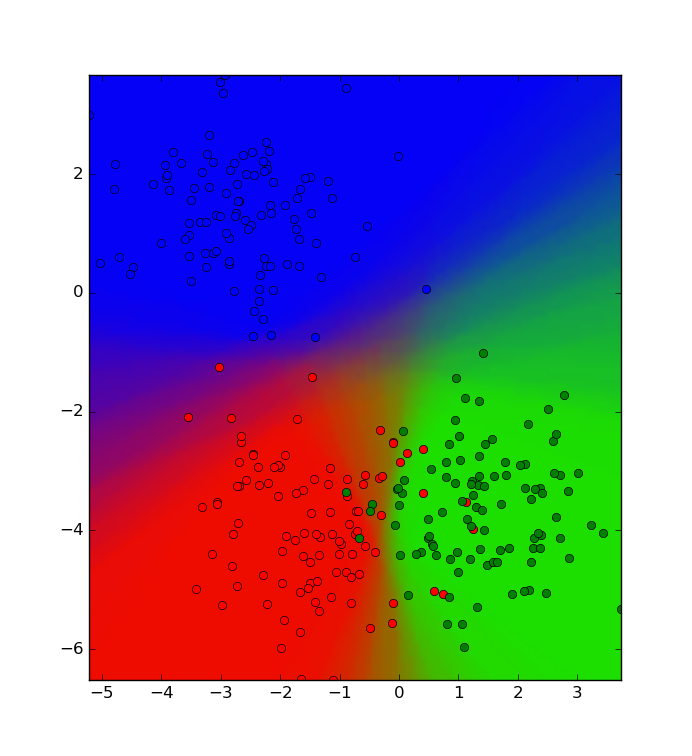
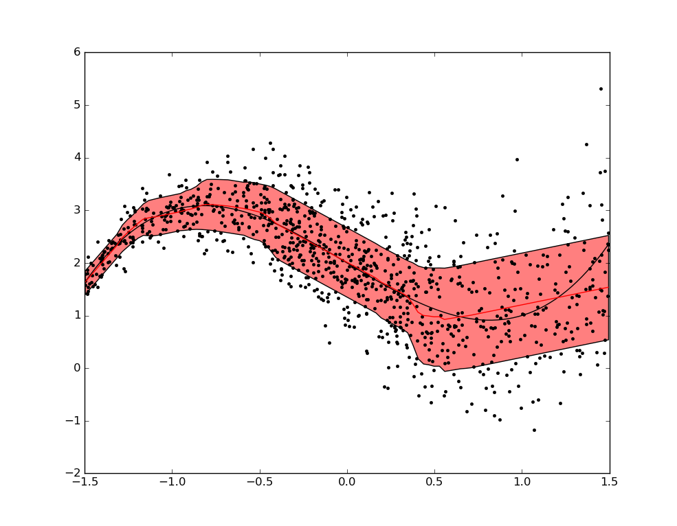

# Teutoburg Forest Library
python wrapper + utilities for random decision forest, built on the [MicrosoftResearch::Cambridge::Sherwood C++ library][1]

## Classification
For a demo illustrating the usage of the library for 2D classification, see [demo_classify.py][2]

## Regression
For a demo illustrating the usage of the library for 1D regression, see [demo_regression.py][3]

[1]: https://www.microsoft.com/en-us/download/details.aspx?id=52340
[2]: demo_classify.py
[3]: demo_regression.py
